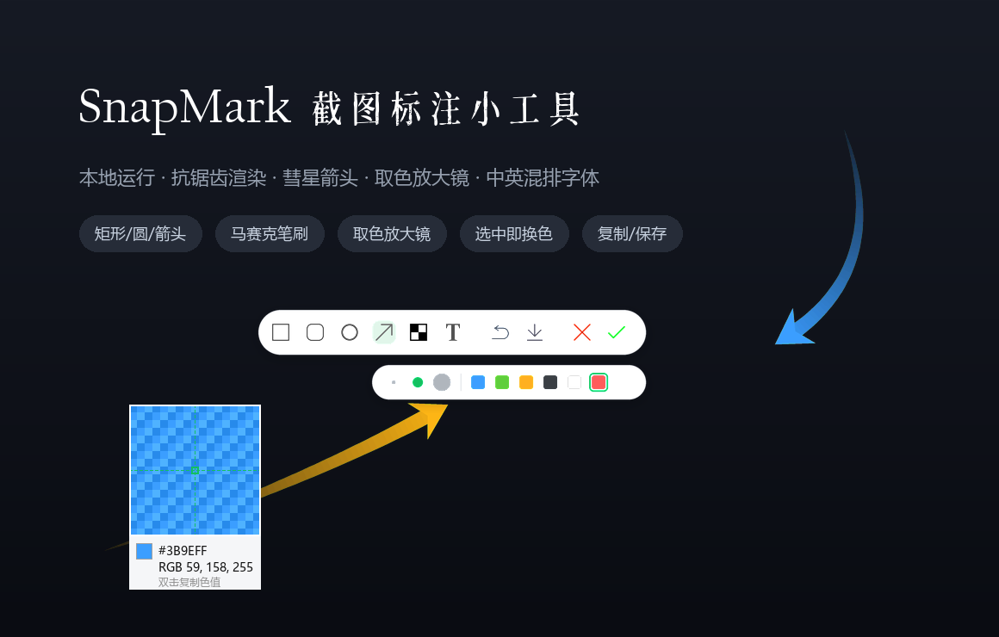
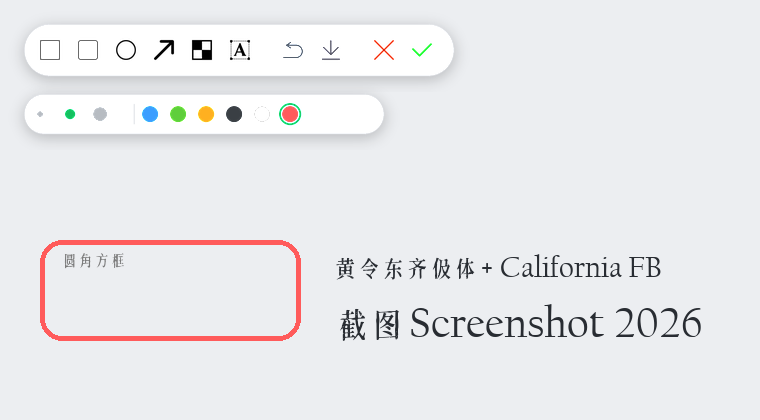

<div align="center">

# SnapMark · 截图标注小工具

**纯本地、零云端依赖的 Windows 截图 + 标注工具**
Snipaste 风格的绿色选区与圆角药丸工具栏 · 全程 Pillow 抗锯齿渲染




</div>

---

## ✨ 简介

SnapMark 是一个用 **Python + Pillow + tkinter** 写成的单文件截图标注工具，完全在本地运行，不联网、不上传、不安装后台服务。按下快捷键即可框选屏幕任意区域，配上一套简约美观的矢量工具栏进行标注，一键复制到剪贴板或保存为 PNG。

所有图标、选框、标注元素均经过 **超采样抗锯齿 + 预乘 Alpha** 处理，边缘平滑无锯齿；箭头采用可弯折、可旋转的「彗星尾巴」造型。

> 💡 **无需依赖微信 / QQ 等聊天工具自带的截图功能**。SnapMark 提供全局快捷键，也支持 `--shot` 立即截一张——可以把它绑定到任意**快捷键软件或鼠标手势工具**上一键唤起，例如 AnyWhere 的 action ring、Quicker、AutoHotkey、罗技 / 雷蛇鼠标手势等，随手即截。

## 🎯 功能特性

- **🎨 取色放大镜** — 框选前自带十字放大镜，实时显示 HEX / RGB 色值，**双击或 Ctrl+C** 复制色值。
- **📐 丰富标注** — 矩形、圆角矩形、椭圆、箭头、马赛克、文字，六种工具随取随用。
- **🏹 彗星箭头** — 平滑渐隐的彗星尾巴 + 中国古箭式倒刺箭头；拖动中心圆点可**弯折**成拐弯箭头，拖右上角 ↻ 可**整体旋转**方位。
- **🟦 马赛克笔刷** — 支持**方形 / 圆形**两种笔刷、三档大小，涂抹即时打码，所见即所得。
- **✍️ 精致文字** — 中文用 **黄令东齐伋体**、英文数字用 **California FB** 自动混排；支持 **Shift+Enter 多行**，输入框随内容自适应。
- **🖌️ 三档粗细 + 调色板** — 6 种预设色 + 自定义取色；**选中任意带色要素即可点色块换色**。
- **🖐️ 可视化编辑** — 元素悬停即显示点划虚线框与节点，可自由拖动、缩放、双击文字二次编辑。
- **📋 输出** — ✓ 复制到剪贴板、💾 保存 PNG/JPG、↶ 撤销，Esc 随时退出。
- **⚡ 单实例常驻** — 全局快捷键唤起，重复启动自动转为「再截一张」，可设开机自启。

<div align="center">
<br>
<sub>框选 + 高亮 + 彗星箭头 + 文字批注</sub>
<br><br>
<br>
<sub>方形 / 圆形马赛克笔刷，敏感信息一键打码</sub>
<br><br>
<br>
<sub>统一线性图标 · 平滑药丸工具栏 · 中英混排标注字体</sub>
</div>

## 📦 安装

需要 Python 3.9+（Windows）。

```bash
git clone https://github.com/<your-name>/SnapMark.git
cd SnapMark
pip install -r requirements.txt
```

> 依赖极简：仅 `Pillow`（`tkinter` 为 Python 标准库自带）。`numpy` 若存在会用于更高质量的抗锯齿缩放，缺失时自动降级。

## 🚀 使用

```bash
# 常驻后台，按快捷键截图（默认 Ctrl+Alt+`）
python screenshot_tool.py

# 立即截图一次后退出
python screenshot_tool.py --shot

# 自定义快捷键
python screenshot_tool.py --hotkey "ctrl+shift+a"
```

Windows 下也可直接双击项目内的脚本：

| 脚本 | 作用 |
| --- | --- |
| `启动截图工具.vbs` | 无窗口后台常驻启动（放进「启动」文件夹即可开机自启） |
| `重启截图工具.vbs` | 一键结束旧实例并干净重启 |
| `截图一次.bat` | 立即截图一次 |
| `截图工具(带窗口).bat` | 带控制台窗口启动，便于查看日志 |

## ⌨️ 快捷键

| 按键 | 功能 |
| --- | --- |
| `Ctrl` + `Alt` + `` ` `` | 唤起截图（默认，可自定义） |
| 双击 / `Ctrl` + `C` | 取色阶段复制色值 |
| `Ctrl` + `C` | 编辑阶段复制截图到剪贴板 |
| `Ctrl` + `S` | 保存到本地 |
| `Ctrl` + `Z` | 撤销上一步标注 |
| `Shift` + 拖拽 | 绘制正方形 / 正圆 / 正圆角矩形 |
| `Shift` + `Enter` | 文字换行 |
| `Esc` | 退出当前截图 |

## 🗂️ 目录结构

```
SnapMark/
├─ screenshot_tool.py     # 主程序（单文件）
├─ fonts/                 # 内置标注字体（随程序私有加载，无需系统安装）
│  ├─ QijiFallback.ttf              # 黄令东齐伋体（中文）
│  └─ PangMenZhengDaoCuShuTi.ttf    # 备用字体
├─ icon/                  # 工具栏矢量图标（PNG）
├─ assets/                # 预览图
├─ requirements.txt
└─ *.vbs / *.bat          # Windows 启动脚本
```

## 🔤 字体与图标致谢

- **黄令东齐伋体**、**庞门正道粗书体** 均来自开源免费字体合集 [wordshub/free-font](https://github.com/wordshub/free-font)，版权归原作者所有，仅随本项目内置用于文字标注渲染。
- 工具栏图标为线性简约风格矢量图。

> 若计划商用，请自行确认所用字体的授权范围。

## 🤝 贡献

欢迎提交 Issue 与 Pull Request：Bug 反馈、新标注工具、跨平台适配等都非常欢迎。提交前请确保 `python screenshot_tool.py --shot` 能正常运行。

## 📄 许可证

本项目基于 [MIT License](LICENSE) 开源。字体文件遵循其各自的原始授权。
