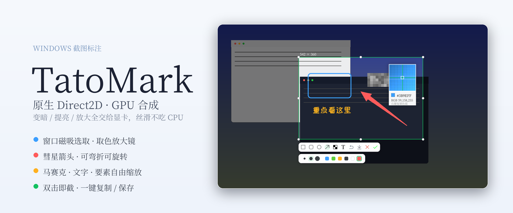
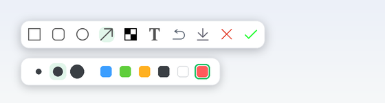
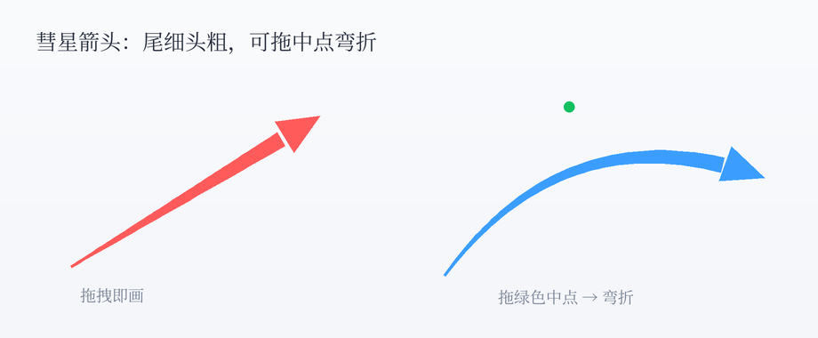
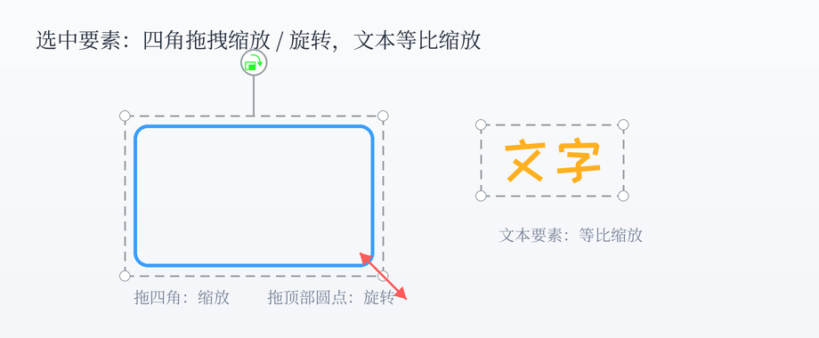

<p align="center">
  
</p>

<h1 align="center">TatoMark</h1>

<p align="center">
  原生 <b>Direct2D · GPU 合成</b> 的极速截图标注工具（Windows）
</p>

<p align="center">
  窗口磁吸 · 取色放大镜 · 彗星箭头 · 马赛克 · 文字标注 · 一键复制 / 保存
</p>

---

## 特性

- **GPU 合成、几乎不吃 CPU** —— 桌面被当作 GPU 纹理，变暗、选区提亮、放大镜缩放全部由 Direct2D 合成，移动跟手、拉框丝滑。
- **窗口磁吸** —— 鼠标移动自动吸附最近的窗口 / 控件并高亮，单击即选取；也可拖拽自定义框选。
- **取色放大镜** —— 实时像素放大 + 绿色十字准星，面板显示 `#HEX / RGB`，**右键复制光标处色值**。
- **丰富标注** —— 矩形 / 圆角矩形 / 椭圆 / **彗星箭头**（可拖中点弯折）/ **马赛克**（方·圆笔刷 + 3 档）/ **文字**（思源宋体 · 站酷快乐体）。
- **要素可编辑** —— 选中后拖动、四角缩放 / 旋转、换色、删除，撤销随时可退。
- **一键出图** —— **双击**当前窗口即截屏并复制到剪贴板（有输入焦点则自动粘贴）；也可保存 PNG。

<p align="center">
  
</p>

## 使用

进入后覆盖全屏截图层：

| 操作 | 效果 |
|---|---|
| 移动鼠标 | 取色放大镜 + 就近窗口磁吸高亮 |
| 单击窗口 / 拖拽 | 吸附选取 / 自定义框选 |
| **双击** | 截取当前窗口，复制到剪贴板并退出（有光标则自动粘贴） |
| **右键** | 复制光标处色值并退出 |
| 框选后工具栏 | 矩形 / 圆角矩形 / 椭圆 / 箭头 / 马赛克 / 文字 / 撤销 / 保存 / 取消 / 完成 |
| **✓** | 复制到剪贴板并退出 |
| 保存 | 存为 `TatoMark_年月日_时分秒.png`，保存后自动关闭 |
| **Ctrl+Z / Delete** | 撤销 / 删除选中要素 |
| **Esc** | 退出 |

> 文字功能依赖 exe 同目录的 `fonts/`（思源宋体 / 站酷快乐体），分发时请连 `fonts/`、`icon/` 一起。

## 标注与编辑

**彗星箭头** —— 在选区内拖拽即画，尾细头粗、带渐隐拖尾；画完后中点出现绿色控制点，拖它把箭头弯折成弧线 / 拐弯箭头。

<p align="center">
  
</p>

**缩放 / 旋转（合并到四角）** —— 选中任意要素后出现灰色虚线包围盒；拖四角即可任意缩放，靠近角点还能旋转；顶部圆点是旋转手柄。**文本要素等比缩放**，不变形。

<p align="center">
  
</p>

## 自定义 / 更换开源字体

文字工具的两种字体不是写死的，可自由替换成任意开源字体（下拉里固定两个槽位）。字体配置集中在 `main.cpp` 顶部三处数组 + 一处文件名，一一对应：

| 位置 | 含义 | 默认值 |
|---|---|---|
| `g_fontFiles`（`RegisterFonts` 内） | ttf **文件名**（放在 `fonts/`） | `SourceHanSerifCN-Regular.ttf` / `ZhanKuKuaiLeTi.ttf` |
| `FONT_FAM[2]` | 字体**内部族名**（DirectWrite 用它匹配，必须精确） | `Source Han Serif CN` / `HappyZcool-2016` |
| `FONT_NAME[2]` | 下拉里显示的**中文名** | `思源宋体` / `站酷快乐体` |

替换步骤：

1. 把新的 `.ttf` 放进 `fonts/`。
2. 改 `g_fontFiles` 里对应的文件名。
3. 改 `FONT_FAM` 为该字体的**真实族名** —— 这一步最关键。查族名的方法：右键 ttf → 属性，或用
   ```powershell
   Add-Type -AssemblyName System.Drawing
   (New-Object System.Drawing.Text.PrivateFontCollection).AddFontFile("fonts\你的字体.ttf")
   ```
   族名不对会回退成系统默认字体。
4. 改 `FONT_NAME` 为你想在下拉里显示的名字。
5. `build.bat` 重新编译。

> 想加更多字体槽位，把这三个数组扩容并同步下拉逻辑即可。

## 编译

需要现代 GCC（conda 自带的 mingw 5.3 太旧，会在 `d2d1.h` 触发编译器崩溃）。推荐便携版 **[w64devkit](https://github.com/skeeto/w64devkit)**：

```bat
build.bat
```

`build.bat` 会先用 `windres` 编译 DPI 清单（`app.rc` → Per-Monitor-V2，避免高分屏被系统放大），再链接生成 `TatoMarkD2D.exe`。默认调用 `C:\Users\kebia\tools\w64devkit\bin\g++.exe`，也可换成任意现代 g++ 或 MSVC。

```
g++ -std=c++17 -O2 main.cpp app_res.o -o TatoMarkD2D.exe -mwindows -static \
  -ld2d1 -ldwrite -lwindowscodecs -ldwmapi -lcomdlg32 -lgdi32 -luser32 -lole32 -luuid
```

## 目录结构

```
TatoMark/
├─ main.cpp               单文件 Direct2D 应用
├─ build.bat              一键编译
├─ app.rc / app.manifest  Per-Monitor-V2 DPI 清单
├─ fonts/                 思源宋体 · 站酷快乐体
├─ icon/                  工具栏图标
└─ assets/                宣传图
```

## 技术栈

Win32 + **Direct2D**（合成 / 几何 / 位图画刷）+ **DirectWrite**（自建字体集合，直接从 ttf 加载）+ **WIC**（PNG 编码 / 剪贴板位图）。渲染目标锁定 96 DPI，物理像素 1:1 映射。

## 许可

见 [LICENSE](LICENSE)。字体版权归各自作者所有。
